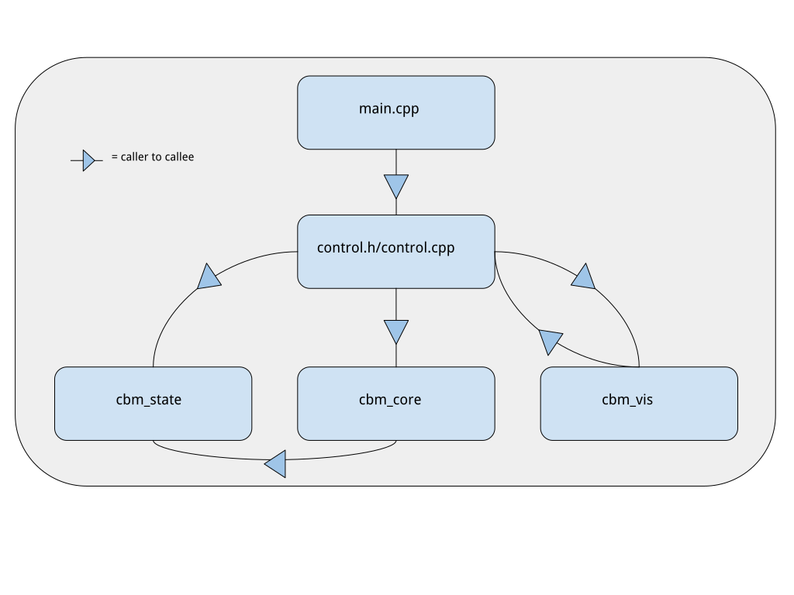

# CbmSim -- a Cerebellar Simulation

CbmSim is a biologically-derived, conductance-based, single-compartment spiking model of the cerebellum,
designed by the Mauk Lab at the University of Texas at Austin. CbmSim has two major modes of operation:
synaptogenesis and eyelid conditioning simulation. Further information concerning these two modes can be
found in [Build Mode](#build-mode) and [Run Mode](#run-mode). Most known cerebellar cortex cell populations are included within
the simulation: their types and numbers are as follows:

- Mossy Fibers: 4,096
- Granule Cells: 1,048,576
- Golgi Cells: 4,096
- Basket Cells: 128
- Stellate Cells: 512
- Purkinje Cells: 32
- Deep Cerebellar Nucleus Cells: 8
- Inferior Olive Cells: 4

For detailed information about each file/module, see the documentation (make link).

## Scope
The simulation has been designed in the context of eyelid-conditioning in rabbits and is tuned to this task.
Build files are used as synaptogenesis input, and session files are used as eyelid-conditioning training input.

CbmSim can be extended to other tasks, such as different patterns of mossy fiber input and entrainment of multiple
slices or microzones, with the latter currently not being implemented.

## Quickstart

**Prerequisites**

We run our simulations on Ubuntu 22.04, and we utilize CUDA to calculate the majority of cellular activity. The following
table summarizes the general pre-requisites for running simulations with CbmSim:

| Category                  | Prerequisite           |
| ------------------------- | ---------------------- |
| OS                        | Ubuntu 22.04 (x86_64)  |
| GPU Compute Capability    | >= 7.5                 |
| CUDA Version              | >= 11.8                |

A detailed description of the CUDA installation process can be found [here](https://docs.nvidia.com/cuda/archive/11.8.0/cuda-installation-guide-linux/index.html).

**Getting Started**

Once you have fulfilled all of the prerequisites and have cloned the repository, compile the source code:

```make```

or if you are interested in development, run:

```make debug```

Running either command will generate the necessary output directories, including the build-outputs as well as
the data output folder.

From there, enter the desired build directory (build or build/debug) and run the binary (./cbm_sim) from there.

## Detailed Usage

For a summary of the various commandline options, run:

```./cbm_sim -h```
or
```./cbm_sim --help```

See [Organization] for a detailed description of the code organization, but generally there are two modes of operation:
build mode and run mode. Build mode creates the connections within/between the cell-layers, and run mode simulates
the dynamics of the network.

#### Build Mode

To build the connectivity arrays, the general command is the following:

```
./cbm_sim -b [BUILD_FILE.bld] -o [OUTPUT_BASE]
```

OUTPUT_BASE specifies the basename that is used to name the output directory and the file basename of the
generated simulation file. See [Build File Specification](#build-file-specification) for details on the
contents/syntax of a build file.

#### Run Mode

To run a simulation, the general command is the following:

```
./cbm_sim [OPT_ARGS]  -i [INPUT_FILE.sim] -s [SESSION_FILE.sess] -o [OUTPUT_BASE] [OUTPUT_ARGS]
```
INPUT_FILE.sim contains the input-state data for the network, which could be generated by running in build mode,
or as the output from a previous run in run mode. See [Session File Specification](#session-file-specification)
for details on the contents of a session file. OUTPUT_BASE is the same as build mode, except all outputs from
run mode will be placed there.

The following table summarizes the optional arguments:

| Option      | Argument       | Description                                                    |
| ----------- | -------------- | -------------------------------------------------------------- |
| --visual    | TUI or GUI     | run from the commandline or the GUI                            |
| --pfpc-off  | None           | turn parallel fiber to purkinje cell plasticity off            |
| --binary    | None           | set parallel fiber to purkinje cell plasticity mode to binary  |
| --cascade   | None           | set parallel fiber to purkinje cell plasticity mode to cascade |
| --mfnc-off  | None           | turn mossy fiber to deep nucleus plasticity off                |

The following table summarizes the output arguments:

| Option          | Argument                | Description                                                                      |
| --------------- | ----------------------- | -------------------------------------------------------------------------------- |
| -r or --raster  | MF,GR,GO,BC,SC,PC,NC,IO | specify cell-raster data to save. Any subset of the argument is accepted         |
| -p or --psth    | MF,GR,GO,BC,SC,PC,NC,IO | specify cell-psth data to save. Any subset of the argument is accepted           |
| -w or --weights | PFPC,MFNC               | specify plastic synaptic weights to save. Any subset of the argument is accepted |

The argument of all output options must be a comma-separated list of IDs, as given by the Argument column above. Single IDs are
also accepted.

## Organization

The following diagram describes the conceptual organization of CbmSim, where arrows indicate which
module calls functions to either request data or to alter data from another module.



A summary of each module is as follows:

- `main` is the entry point, and interfaces solely with the `control` module.
- `control` module is the arbiter of farming out the main tasks of the simulation, such as constructing connectivity arrays,
  initializing poisson inputs at the mossy fiber layer, and so on.
- `cbm_state` contains the state information of all cellular layers including connectivity relationships and cell-wise activity data. It is polled by `control` when the
  user requests a simulation to be built, and is briefly instantiated from file when the user requests for a simulation
  to be run.
- `cbm_core` is the heart of CbmSim: it sets up memory on the GPUs and is tasked with updating cellular activities
  and then broadcasting these activities as the inputs for downstream neurons. It is also tasked with updating the plasticities
  of the two major sites of plasticity in the cerebellum: the parallel fiber to purkinje cell synapses and the mossy fiber to
  deep cerebellar nucleus synapses.
- `cbm_vis` controls the graphical user interface (GUI) of CbmSim. It polls `control` for simulation-related data, and `control`
  polls it for run-time-related graphical updates while a simulation is running.

Not pictured is `cxx_tools` which includes a myriad of objects and functions that are used throughout the other modules.
Details can be found at the docs page (Work In Progress)

## Build File Specification

The basic syntax of a build file is the following:

```
begin filetype build
    // this is a comment
    begin section params
        int param_1 3
        float param_2 4
        bool param_3 false
    end
end
```
The syntactical rules for build files are as follows:

- a build file must start with either any combination of newlines or single line comments
- immediately proceeding after initial comments and newlines, the line `begin filetype build` must
  be given
- each `begin` tag must have an associated `end` tag. Such a pair plus any number of tokens in between is
  deemed a "block". The `begin` and `end` tags can be on the same line or at any level of indentation.
- a single line comment is any series of tokens starting with two forward slashes `//` and ending with a newline
  character (\n). The double-forward slash marker can be preceeded by any number of tokens in the same line.
- a section is a block beginning with `begin section section_name` and ending with `end`. Here `section_name`
  is of your choosing.
- within the `begin filetype build end` block there may be any number of sections.
- A section block can only contain parameters (recursive sections are so-far not supported)
- a parameter is a line or sequence of lines containing a type, a parameter identifier, and a value. Supported
  types include `int`, `float` and `bool`, as used in C and C++ programming languages.

Importantly, as of release 0.1.0, section name-parsing is hard-coded into the parsing algorithm, and there are only two
currently supported section names: `connectivity` and `activity`. For now, you will have to add custon section names into
the parser yourself (see `file_parse.h` and `file_parse.cpp`)

## Session File Specification

The basic syntax of a session file is the following:

```
begin filetype run
    begin section trial_def
        // you can comment here
        def trial trial_name // you can also comment here
            int use_cs 1
            int cs_onset 400
            int cs_len 250
            float cs_percent 100.0
            int use_us 1
            int us_onset 650
        end

        def block block_name
            trial_name 10
        end

        def session session_name
            block_name 2
        end
    end

    begin section params_1
        int param_1 5
        int param_2 7
    end // and another comment
end
```
The syntactical rules for session files are as follows:

- a session file must start with either any combination of newlines or single line comments
- immediately proceeding after initial comments and newlines, the line `begin filetype run` must
  be given
- each `begin` tag must have an associated `end` tag. Such a pair plus any number of tokens in between
  constitues a "block". The `begin` and `end` tags can be on the same line or at any level of indentation.
- a single line comment is any series of tokens starting with two forward slashes `//` and ending with a newline
  character (\n). The double-forward slash marker can be preceeded by any number of tokens in the same line.
- a section is a block beginning with `begin section section_name` and ending with `end`. Here `section_name`
  is of your choosing (although see below for special names and the scope of release 0.1.0)
- the section whose section_name is `trial_def` is special, and consists of the following:
    - blocks whose beginning tags are `def`
    - any number of `trial` blocks which define the relevant variables for a given trial type
    - any number of `block` blocks which define the number and ordering of specified trials in that block
    - One and only one `session` block which consists of an ordered list of block or trial names and their numbers
- `block` blocks contain a list of defined trial name/number pairs (separated by whitespace or newline)
- `session` blocks contain a list of defined `block` OR `trial` name/number pairs (separated by whitespace or newline)
- all other sections are interpreted as parameter sections, as in the build specification above.

Just as for build files, as of release 0.1.0, section name-parsing is hard-coded into the parsing algorithm. There
are three currently-supported section names: `trial_def`, `mf_input`, `trial_spec`, and `activity`. A short description
of the latter three follows:

- `mf_input`: parameters relating to mossy fiber stimulation, including frequency, if collaterals are enabled, etc.
- `trial_spec`: additional parameters related to trials, such as how long a trial should last, in `msPerTimeStep`.
- `activity`: all physiological parameters for all cell types

## Contributing

1. Check the open issues or open a new issue to discuss ideas (implementation-wise or scientifically-wise!) or any bugs
   you found (we're still in alpha here folks, so the more bug-fixes now the better!)
2. Fork the repository and play around on your own
3. Open a new pull request

## Contact

If you have any questions beyond that which can be answered via the issues or pull-request page, please contact 
[Sean Gallogly](mailto:sean.gallo@austin.utexas.edu)

## Changelog

See [CHANGELOG](./CHANGELOG.md) for an account of the different releases for this project.

